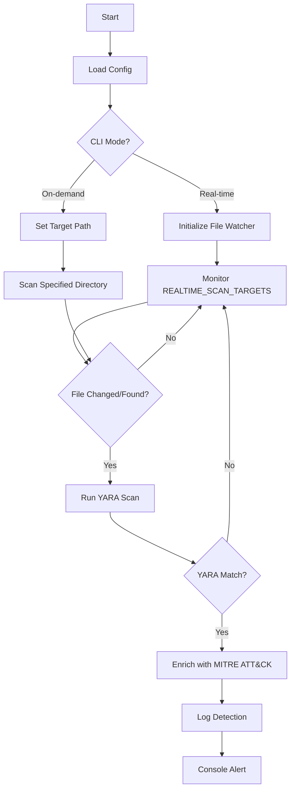

# Real-Time YARA Scanner with MITRE ATT&CK Mapping


A production-grade threat detection system combining YARA rules with MITRE ATT&CK framework integration.

## Features

- **Real-time File Monitoring**: Continuously scans directories for IOCs
- **On-Demand Scanning**: Targeted directory scanning capability
- **MITRE ATT&CK Mapping**: Automatically links detections to techniques
- **Cross-Platform**: Windows, Linux, and macOS support
- **Enterprise-Ready**: Built-in error handling and JSON logging

## Architecture


# Quick Start
```
# Clone the repository

git clone https://github.com/yourusername/yara-attack-scanner.git
cd yara-attack-scanner

# Install dependencies
pip install -r requirements.txt

# Start real-time monitoring
python scanner.py
```


# Configuration
Edit config.py for your environment:
```
# Windows Example
REALTIME_SCAN_TARGETS = [
    os.environ.get('TEMP'),
    os.path.expanduser('~\\Downloads'),
    'C:\\Windows\\System32\\Tasks'
]

# Linux/macOS Example
REALTIME_SCAN_TARGETS = [
    '/tmp',
    '/var/tmp',
    os.path.expanduser('~/.local/bin')
]
```
# Usage Examples
Real-time Monitoring
```
python scanner.py --mode realtime
```
Targeted Scan
```
python scanner.py --mode on-demand --target /path/to/scan
```
Generate ATT&CK Layer
```
python attack_mapper.py --input scan_logs.jsonl --output attack_layer.json
```
YARA Rule Format
```
rule Example_Threat {
    meta:
        description = "Detects malicious behavior"
        mitre_attack_id = "T1059"  # Command-Line Interface
        severity = "high"
    
    strings:
        $malicious = "evil_string" nocase
    
    condition:
        $malicious
}
```
Detection Output
```
{
  "timestamp": "2023-08-20T12:34:56Z",
  "target": "/tmp/malware.exe",
  "rule": "CobaltStrike_Detection",
  "severity": "critical",
  "mitre_attack_id": "T1190",
  "mitre_technique": "Exploit Public-Facing Application"
}
```
## Troubleshooting

| Error | Solution | Command |
|-------|----------|---------|
| YARA compilation error | Validate rule syntax | `yara -s rule.yar testfile` |
| Permission denied | Run as admin/root or adjust paths | `sudo python scanner.py` (Linux/macOS)<br>`Run as Administrator` (Windows) |
| File locked | Add pattern to SKIP_PATTERNS | Add `'*.tmp'` to `config.py` |

# License
MIT License. See LICENSE for details.

